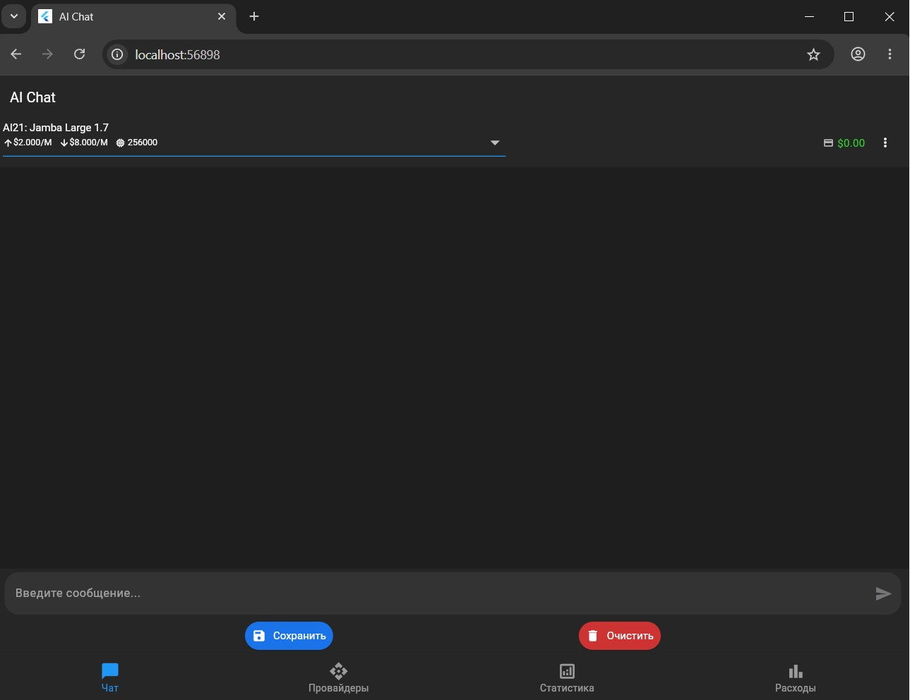
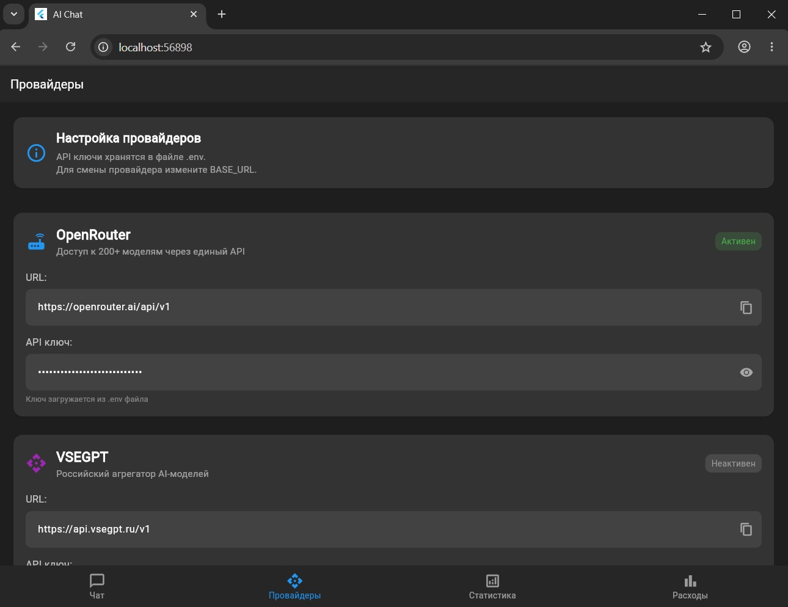
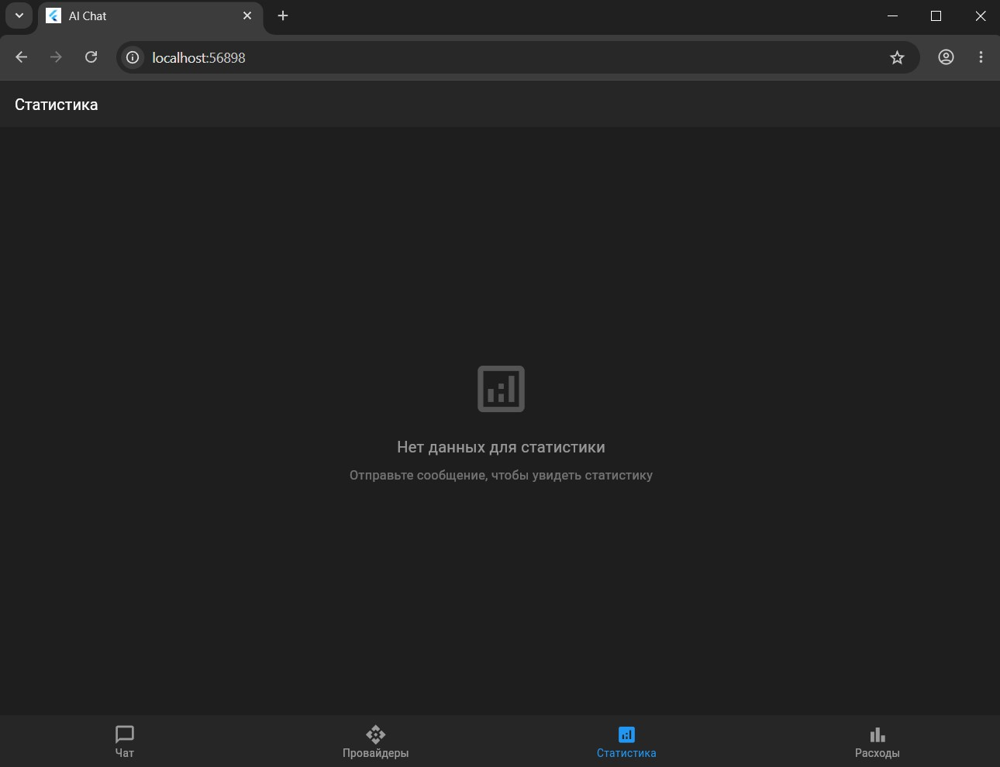
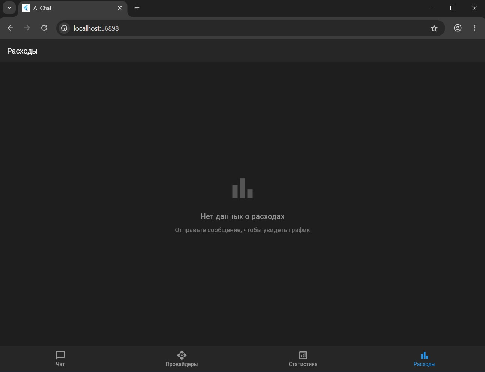

# 🤖 AI Chat Flutter

Многостраничное мобильное приложение для общения с AI-моделями через OpenRouter и VSEGPT с отслеживанием статистики и расходов.

<p align="center">
  
  
  
  
</p>

---

## 📸 Скриншоты

<p align="center">
  
  
  
  
</p>

---

## 📱 Возможности

### 💬 Чат (Главная страница)
- Общение с AI-моделями в реальном времени
- Выбор модели из выпадающего списка (200+ моделей через OpenRouter)
- Отображение количества токенов и стоимости каждого ответа
- Копирование сообщений в буфер обмена
- Экспорт истории в JSON и текстовые логи
- Сохранение истории в локальной базе данных SQLite
- Очистка истории чата

### 🔌 Настройки провайдера
- Просмотр настроек OpenRouter и VSEGPT
- Отображение текущего API ключа и URL
- Индикатор активного провайдера
- Информация о текущем подключении и балансе
- Безопасное хранение ключей в `.env` файле

### 📊 Статистика использования
- Общие показатели: количество сообщений, токенов, стоимость
- Разбивка использования по моделям с процентами
- Сортировка моделей по количеству использованных токенов
- Адаптивное отображение больших чисел (1.5K, 2.3M)
- Автоматическое определение валюты (₽ для VSEGPT, $ для OpenRouter)

### 📈 График расходов
- Столбчатая диаграмма расходов по дням
- Переключение периодов: Неделя / Месяц / Всё время
- Интерактивные тултипы с детальной информацией при нажатии
- Карточка с общей суммой расходов и токенов за период
- Поддержка рублей (VSEGPT) и долларов (OpenRouter)

---

## 🛠 Технологии

| Технология | Версия | Назначение |
|------------|:------:|------------|
| **Flutter** | ≥3.6.0 | Кроссплатформенный UI-фреймворк |
| **Dart** | ≥3.6.0 | Язык программирования |
| **Provider** | ^6.1.2 | Управление состоянием приложения |
| **SQLite** (sqflite) | ^2.3.2 | Локальное хранение истории сообщений |
| **fl_chart** | ^0.69.0 | Построение графиков и диаграмм |
| **http** | ^1.2.1 | HTTP-запросы к API провайдеров |
| **google_fonts** | ^6.2.1 | Кастомные шрифты Roboto |
| **flutter_dotenv** | ^5.1.0 | Загрузка переменных окружения из `.env` |
| **intl** | ^0.20.2 | Форматирование дат и чисел |
| **path_provider** | ^2.1.2 | Доступ к файловой системе |
| **shared_preferences** | ^2.2.2 | Хранение пользовательских настроек |

---

## 📦 Быстрый старт

```bash
# Клонирование
git clone https://github.com/neuro-fill/AIChatFlutter.git
cd AIChatFlutter

# Установка зависимостей
flutter pub get

# Настройка API ключа
cp .env.example .env
# Отредактируйте .env → вставьте ваш OPENROUTER_API_KEY

# Запуск
flutter run

🏗 Архитектура проекта

lib/
├── main.dart                      # Точка входа + MainShell (BottomNavigationBar)
├── api/
│   └── openrouter_client.dart     # HTTP-клиент для OpenRouter и VSEGPT
├── models/
│   └── message.dart               # Модель сообщения (токены, стоимость, модель)
├── providers/
│   └── chat_provider.dart         # Управление состоянием чата (ChangeNotifier)
├── services/
│   ├── database_service.dart      # SQLite: сохранение и загрузка истории
│   └── analytics_service.dart     # Сбор и анализ статистики использования
├── screens/
│   ├── chat_screen.dart           # Экран чата (вкладка 1)
│   ├── provider_screen.dart       # Настройки провайдера (вкладка 2)
│   ├── stats_screen.dart          # Статистика использования (вкладка 3)
│   └── expenses_screen.dart       # График расходов (вкладка 4)
└── assets/                        # Ресурсы приложения

🎨 Навигация
Приложение использует BottomNavigationBar с 4 вкладками и IndexedStack для сохранения состояния:

#	Вкладка	Иконка	Содержание
1	Чат	💬	Основной интерфейс общения с AI
2	Провайдеры	🔌	Настройка API ключей и провайдеров
3	Статистика	📊	Аналитика использования токенов по моделям
4	Расходы	📈	График финансовых затрат по дням

🔑 Поддерживаемые провайдеры
Провайдер	URL	Валюта	Особенности
OpenRouter	https://openrouter.ai/api/v1	$	200+ моделей (GPT-4, Claude, Gemini и др.)
VSEGPT	https://api.vsegpt.ru/v1	₽	Российский агрегатор AI-моделей
Для переключения провайдера измените BASE_URL в .env файле и перезапустите приложение.

📊 Как собирается статистика
Вся статистика извлекается из существующих сообщений чата без дополнительных API-запросов:

Токены — из поля tokens модели ChatMessage

Стоимость — из поля cost (рассчитывается на основе тарифов моделей)

Модель — из поля modelId

Дата — из поля timestamp

Данные агрегируются на клиенте при открытии соответствующих вкладок.

🚀 Планы по развитию
Потоковая передача ответов (streaming)

Переключение между провайдерами без перезапуска

Экспорт статистики в PDF/CSV

Светлая тема оформления

Голосовой ввод сообщений

Поддержка локальных моделей через Ollama

Виджет на домашний экран

👨‍💻 Автор
Создано в рамках курса The-Founder.